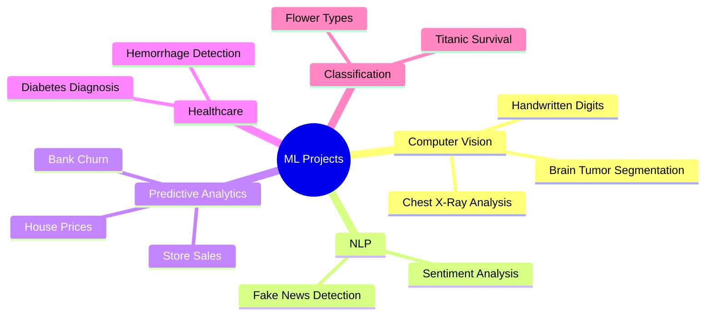

# 🤖 Machine Learning Projects Portfolio

## 📊 Project Overview

This repository contains a diverse collection of machine learning projects, ranging from computer vision to natural language processing and predictive analytics.

## 🛠️ Technologies Used

- **Languages**: Python, R
- **Libraries**: TensorFlow, PyTorch, scikit-learn, pandas
- **Tools**: Jupyter Notebook, Git, Docker

## 🤝 Contributing

Contributions are welcome! Please feel free to submit a Pull Request.

## 📫 Contact

- Email: official.parvizi@gmail.com
- LinkedIn: [Awrsha Parvizi](https://www.linkedin.com/in/awrsha/)

## 📄 License

This project is licensed under the MIT License - see the [LICENSE](LICENSE) file for details.
